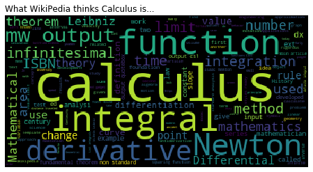

# Calculus: LMTH 2040


- **`version: spring_2020`**

- **MW 10:15 - 11:30am** 


```python
%matplotlib inline
import matplotlib.pyplot as plt
import requests
from bs4 import BeautifulSoup
import wordcloud
```


```python
#get html
r = requests.get('https://en.wikipedia.org/wiki/Calculus')
#extract text
soup = BeautifulSoup(r.text, 'lxml')
text = soup.get_text()
text = text.replace('parser', '')
#make wordcloud
wordcloud = wordcloud.WordCloud().generate(text)
plt.figure(figsize = (20, 4))
plt.imshow(wordcloud)
plt.title('What WikiPedia thinks Calculus is...', loc = 'left')
plt.axis('off');
```





```python
import folium
#create the map
m = folium.Map([40.7352507,-73.9996767], tiles='Stamen Toner', zoom_start=17)
#add a marker
folium.Marker([40.7352507,-73.9996767], popup = "<b>Address:</b> 65 West 11th Street\n<b>Room</b>: 263", icon = folium.Icon(color = 'red', icon = 'info-sign')).add_to(m)
#show the map
m
```


<div style="width:100%;"><div style="position:relative;width:100%;height:0;padding-bottom:60%;"><iframe src="data:text/html;charset=utf-8;base64,PCFET0NUWVBFIGh0bWw+CjxoZWFkPiAgICAKICAgIDxtZXRhIGh0dHAtZXF1aXY9ImNvbnRlbnQtdHlwZSIgY29udGVudD0idGV4dC9odG1sOyBjaGFyc2V0PVVURi04IiAvPgogICAgCiAgICAgICAgPHNjcmlwdD4KICAgICAgICAgICAgTF9OT19UT1VDSCA9IGZhbHNlOwogICAgICAgICAgICBMX0RJU0FCTEVfM0QgPSBmYWxzZTsKICAgICAgICA8L3NjcmlwdD4KICAgIAogICAgPHNjcmlwdCBzcmM9Imh0dHBzOi8vY2RuLmpzZGVsaXZyLm5ldC9ucG0vbGVhZmxldEAxLjUuMS9kaXN0L2xlYWZsZXQuanMiPjwvc2NyaXB0PgogICAgPHNjcmlwdCBzcmM9Imh0dHBzOi8vY29kZS5qcXVlcnkuY29tL2pxdWVyeS0xLjEyLjQubWluLmpzIj48L3NjcmlwdD4KICAgIDxzY3JpcHQgc3JjPSJodHRwczovL21heGNkbi5ib290c3RyYXBjZG4uY29tL2Jvb3RzdHJhcC8zLjIuMC9qcy9ib290c3RyYXAubWluLmpzIj48L3NjcmlwdD4KICAgIDxzY3JpcHQgc3JjPSJodHRwczovL2NkbmpzLmNsb3VkZmxhcmUuY29tL2FqYXgvbGlicy9MZWFmbGV0LmF3ZXNvbWUtbWFya2Vycy8yLjAuMi9sZWFmbGV0LmF3ZXNvbWUtbWFya2Vycy5qcyI+PC9zY3JpcHQ+CiAgICA8bGluayByZWw9InN0eWxlc2hlZXQiIGhyZWY9Imh0dHBzOi8vY2RuLmpzZGVsaXZyLm5ldC9ucG0vbGVhZmxldEAxLjUuMS9kaXN0L2xlYWZsZXQuY3NzIi8+CiAgICA8bGluayByZWw9InN0eWxlc2hlZXQiIGhyZWY9Imh0dHBzOi8vbWF4Y2RuLmJvb3RzdHJhcGNkbi5jb20vYm9vdHN0cmFwLzMuMi4wL2Nzcy9ib290c3RyYXAubWluLmNzcyIvPgogICAgPGxpbmsgcmVsPSJzdHlsZXNoZWV0IiBocmVmPSJodHRwczovL21heGNkbi5ib290c3RyYXBjZG4uY29tL2Jvb3RzdHJhcC8zLjIuMC9jc3MvYm9vdHN0cmFwLXRoZW1lLm1pbi5jc3MiLz4KICAgIDxsaW5rIHJlbD0ic3R5bGVzaGVldCIgaHJlZj0iaHR0cHM6Ly9tYXhjZG4uYm9vdHN0cmFwY2RuLmNvbS9mb250LWF3ZXNvbWUvNC42LjMvY3NzL2ZvbnQtYXdlc29tZS5taW4uY3NzIi8+CiAgICA8bGluayByZWw9InN0eWxlc2hlZXQiIGhyZWY9Imh0dHBzOi8vY2RuanMuY2xvdWRmbGFyZS5jb20vYWpheC9saWJzL0xlYWZsZXQuYXdlc29tZS1tYXJrZXJzLzIuMC4yL2xlYWZsZXQuYXdlc29tZS1tYXJrZXJzLmNzcyIvPgogICAgPGxpbmsgcmVsPSJzdHlsZXNoZWV0IiBocmVmPSJodHRwczovL3Jhd2Nkbi5naXRoYWNrLmNvbS9weXRob24tdmlzdWFsaXphdGlvbi9mb2xpdW0vbWFzdGVyL2ZvbGl1bS90ZW1wbGF0ZXMvbGVhZmxldC5hd2Vzb21lLnJvdGF0ZS5jc3MiLz4KICAgIDxzdHlsZT5odG1sLCBib2R5IHt3aWR0aDogMTAwJTtoZWlnaHQ6IDEwMCU7bWFyZ2luOiAwO3BhZGRpbmc6IDA7fTwvc3R5bGU+CiAgICA8c3R5bGU+I21hcCB7cG9zaXRpb246YWJzb2x1dGU7dG9wOjA7Ym90dG9tOjA7cmlnaHQ6MDtsZWZ0OjA7fTwvc3R5bGU+CiAgICAKICAgICAgICAgICAgPG1ldGEgbmFtZT0idmlld3BvcnQiIGNvbnRlbnQ9IndpZHRoPWRldmljZS13aWR0aCwKICAgICAgICAgICAgICAgIGluaXRpYWwtc2NhbGU9MS4wLCBtYXhpbXVtLXNjYWxlPTEuMCwgdXNlci1zY2FsYWJsZT1ubyIgLz4KICAgICAgICAgICAgPHN0eWxlPgogICAgICAgICAgICAgICAgI21hcF8xNDBlODczMzk1Yzc0MzlkYmFjZGVhYTg1ODE1ZWIxMiB7CiAgICAgICAgICAgICAgICAgICAgcG9zaXRpb246IHJlbGF0aXZlOwogICAgICAgICAgICAgICAgICAgIHdpZHRoOiAxMDAuMCU7CiAgICAgICAgICAgICAgICAgICAgaGVpZ2h0OiAxMDAuMCU7CiAgICAgICAgICAgICAgICAgICAgbGVmdDogMC4wJTsKICAgICAgICAgICAgICAgICAgICB0b3A6IDAuMCU7CiAgICAgICAgICAgICAgICB9CiAgICAgICAgICAgIDwvc3R5bGU+CiAgICAgICAgCjwvaGVhZD4KPGJvZHk+ICAgIAogICAgCiAgICAgICAgICAgIDxkaXYgY2xhc3M9ImZvbGl1bS1tYXAiIGlkPSJtYXBfMTQwZTg3MzM5NWM3NDM5ZGJhY2RlYWE4NTgxNWViMTIiID48L2Rpdj4KICAgICAgICAKPC9ib2R5Pgo8c2NyaXB0PiAgICAKICAgIAogICAgICAgICAgICB2YXIgbWFwXzE0MGU4NzMzOTVjNzQzOWRiYWNkZWFhODU4MTVlYjEyID0gTC5tYXAoCiAgICAgICAgICAgICAgICAibWFwXzE0MGU4NzMzOTVjNzQzOWRiYWNkZWFhODU4MTVlYjEyIiwKICAgICAgICAgICAgICAgIHsKICAgICAgICAgICAgICAgICAgICBjZW50ZXI6IFs0MC43MzUyNTA3LCAtNzMuOTk5Njc2N10sCiAgICAgICAgICAgICAgICAgICAgY3JzOiBMLkNSUy5FUFNHMzg1NywKICAgICAgICAgICAgICAgICAgICB6b29tOiAxNywKICAgICAgICAgICAgICAgICAgICB6b29tQ29udHJvbDogdHJ1ZSwKICAgICAgICAgICAgICAgICAgICBwcmVmZXJDYW52YXM6IGZhbHNlLAogICAgICAgICAgICAgICAgfQogICAgICAgICAgICApOwoKICAgICAgICAgICAgCgogICAgICAgIAogICAgCiAgICAgICAgICAgIHZhciB0aWxlX2xheWVyX2RhZjNkNzE5ZTMxMjRkYTdiNzI3M2YwM2U5OGYzOTdlID0gTC50aWxlTGF5ZXIoCiAgICAgICAgICAgICAgICAiaHR0cHM6Ly9zdGFtZW4tdGlsZXMte3N9LmEuc3NsLmZhc3RseS5uZXQvdG9uZXIve3p9L3t4fS97eX0ucG5nIiwKICAgICAgICAgICAgICAgIHsiYXR0cmlidXRpb24iOiAiTWFwIHRpbGVzIGJ5IFx1MDAzY2EgaHJlZj1cImh0dHA6Ly9zdGFtZW4uY29tXCJcdTAwM2VTdGFtZW4gRGVzaWduXHUwMDNjL2FcdTAwM2UsIHVuZGVyIFx1MDAzY2EgaHJlZj1cImh0dHA6Ly9jcmVhdGl2ZWNvbW1vbnMub3JnL2xpY2Vuc2VzL2J5LzMuMFwiXHUwMDNlQ0MgQlkgMy4wXHUwMDNjL2FcdTAwM2UuIERhdGEgYnkgXHUwMDI2Y29weTsgXHUwMDNjYSBocmVmPVwiaHR0cDovL29wZW5zdHJlZXRtYXAub3JnXCJcdTAwM2VPcGVuU3RyZWV0TWFwXHUwMDNjL2FcdTAwM2UsIHVuZGVyIFx1MDAzY2EgaHJlZj1cImh0dHA6Ly93d3cub3BlbnN0cmVldG1hcC5vcmcvY29weXJpZ2h0XCJcdTAwM2VPRGJMXHUwMDNjL2FcdTAwM2UuIiwgImRldGVjdFJldGluYSI6IGZhbHNlLCAibWF4TmF0aXZlWm9vbSI6IDE4LCAibWF4Wm9vbSI6IDE4LCAibWluWm9vbSI6IDAsICJub1dyYXAiOiBmYWxzZSwgIm9wYWNpdHkiOiAxLCAic3ViZG9tYWlucyI6ICJhYmMiLCAidG1zIjogZmFsc2V9CiAgICAgICAgICAgICkuYWRkVG8obWFwXzE0MGU4NzMzOTVjNzQzOWRiYWNkZWFhODU4MTVlYjEyKTsKICAgICAgICAKICAgIAogICAgICAgICAgICB2YXIgbWFya2VyX2IxZGU4NGU5OGUyMjQ4MzhiYzFiMGJkMWQzNGM5OWViID0gTC5tYXJrZXIoCiAgICAgICAgICAgICAgICBbNDAuNzM1MjUwNywgLTczLjk5OTY3NjddLAogICAgICAgICAgICAgICAge30KICAgICAgICAgICAgKS5hZGRUbyhtYXBfMTQwZTg3MzM5NWM3NDM5ZGJhY2RlYWE4NTgxNWViMTIpOwogICAgICAgIAogICAgCiAgICAgICAgICAgIHZhciBpY29uXzZkNzI4Y2ZjNDFjOTQyZDc5N2E1MGVmYzVmMzExZjlkID0gTC5Bd2Vzb21lTWFya2Vycy5pY29uKAogICAgICAgICAgICAgICAgeyJleHRyYUNsYXNzZXMiOiAiZmEtcm90YXRlLTAiLCAiaWNvbiI6ICJpbmZvLXNpZ24iLCAiaWNvbkNvbG9yIjogIndoaXRlIiwgIm1hcmtlckNvbG9yIjogInJlZCIsICJwcmVmaXgiOiAiZ2x5cGhpY29uIn0KICAgICAgICAgICAgKTsKICAgICAgICAgICAgbWFya2VyX2IxZGU4NGU5OGUyMjQ4MzhiYzFiMGJkMWQzNGM5OWViLnNldEljb24oaWNvbl82ZDcyOGNmYzQxYzk0MmQ3OTdhNTBlZmM1ZjMxMWY5ZCk7CiAgICAgICAgCiAgICAKICAgICAgICB2YXIgcG9wdXBfMzhjYjJlMDQ0ZTVmNDkwMThmYTBkNDQ3NDAxNzYzMmIgPSBMLnBvcHVwKHsibWF4V2lkdGgiOiAiMTAwJSJ9KTsKCiAgICAgICAgCiAgICAgICAgICAgIHZhciBodG1sX2I3YzliZWJjYjgwMDQ3MTY5NzE3ZDE5NDNmNDJmZjc2ID0gJChgPGRpdiBpZD0iaHRtbF9iN2M5YmViY2I4MDA0NzE2OTcxN2QxOTQzZjQyZmY3NiIgc3R5bGU9IndpZHRoOiAxMDAuMCU7IGhlaWdodDogMTAwLjAlOyI+PGI+QWRkcmVzczo8L2I+IDY1IFdlc3QgMTF0aCBTdHJlZXQgPGI+Um9vbTwvYj46IDI2MzwvZGl2PmApWzBdOwogICAgICAgICAgICBwb3B1cF8zOGNiMmUwNDRlNWY0OTAxOGZhMGQ0NDc0MDE3NjMyYi5zZXRDb250ZW50KGh0bWxfYjdjOWJlYmNiODAwNDcxNjk3MTdkMTk0M2Y0MmZmNzYpOwogICAgICAgIAoKICAgICAgICBtYXJrZXJfYjFkZTg0ZTk4ZTIyNDgzOGJjMWIwYmQxZDM0Yzk5ZWIuYmluZFBvcHVwKHBvcHVwXzM4Y2IyZTA0NGU1ZjQ5MDE4ZmEwZDQ0NzQwMTc2MzJiKQogICAgICAgIDsKCiAgICAgICAgCiAgICAKPC9zY3JpcHQ+" style="position:absolute;width:100%;height:100%;left:0;top:0;border:none !important;" allowfullscreen webkitallowfullscreen mozallowfullscreen></iframe></div></div>


- **Jacob Frias Koehler**: koehlerj@newschool.edu
- **Office Hours**: By Appointment


## Course Description

This course provides students with an overview of the main ideas in calculus: *integration, differentiation,* and *differential equations*.  We aim to familiarize you with the concepts and applications across a variety of disciplines.  Additionally, students will strengthen their ability to use technology to do mathematics.  

### Prerequisites

Basic arithmetic and some experience with algebra and functions.

### Recommended Texts

While I imagine we will get all the information we need from lecture materials, problem sets, and specific readings -- it is good to have reference material around.  First, I encourage you to get an older copy of a large Calculus textbook.  Here are some examples, I'd try to not spend more than twenty dollars:

<div class="alert alert-primary" role="alert">
    
**Traditional Calculus Textbooks**
    
    
- [**Stewart's Calculus**](https://www.amazon.com/Calculus-7th-James-Stewart/dp/0538497815): Any edition, one of the most popular textbooks -- for better or worse.
- [**Anton, Bivens, Davis**](https://www.amazon.com/Calculus-Howard-Anton/dp/0470183497): Any edition, authors are nice people.
- [**Larson Calculus**](https://www.amazon.com/Calculus-Ron-Larson/dp/1337275344/ref=pd_sbs_14_17?_encoding=UTF8&pd_rd_i=1337275344&pd_rd_r=7863659e-a2a0-4a24-8816-d04b5da77eac&pd_rd_w=keHMI&pd_rd_wg=cuVVh&pf_rd_p=bdd201df-734f-454e-883c-73b0d8ccd4c3&pf_rd_r=S8E686FFMK35BXYFNS19&psc=1&refRID=S8E686FFMK35BXYFNS19): Any edition, another popular textbook.
- [**Edwards and Penny**](https://www.amazon.com/Multivariable-Calculus-6th-Henry-Edwards/dp/0130339679/ref=sr_1_3?keywords=edwards+calculus&qid=1579551485&s=books&sr=1-3): Any edition, Edwards has many nice textbooks.
    
</div>

Many free calculus textbooks are also available, here are some suggestions:

<div class="alert alert-primary" role="alert">
    
**Online Calculus Texts**

- [**OpenStax**](https://openstax.org/details/books/calculus-volume-1): Part of series of texts available for view online or pdf download.
- [**Calculus I and II**](http://www.freebookcentre.net/maths-books-download/Calculus-I-%28Paul-Dawkins%29.html): Paul Dawkins open calculus textbook.
- [**Strang's Calculus**](https://ocw.mit.edu/resources/res-18-001-calculus-online-textbook-spring-2005/textbook/): Classic text from MIT's Gilbert Strang.
    
</div>


Besides texts, there are many additional resources available for support.  I like YouTube and video, here are additional suggestions:

<div class="alert alert-primary" role="alert">

**Video Series on Calculus**
    
    
- [**MIT Big Picture of Calculus**](https://ocw.mit.edu/resources/res-18-005-highlights-of-calculus-spring-2010/highlights_of_calculus/big-picture-of-calculus/): Brief video series on big picture of calculus.
- [**3Blue1Brown Essence of Calculus**](https://www.youtube.com/watch?v=WUvTyaaNkzM): Popular YouTube station series on big picture of calculus.
    
</div>


## Course Policies

Resources  The university provides many resources to help students achieve academic and artistic excellence. These resources include:
- University Libraries: http://library.newschool.eduhttp://library.newschool.edu/
- University Learning Center: http://www.newschool.edu/learning-center 
- University Disabilities Service: www.newschool.edu/student-disability-services/   In keeping with the university’s policy of providing equal access for students with disabilities, any student with a disability who needs academic accommodations is welcome to meet with me privately. All conversations will be kept confidential. Students requesting any accommodations will also need to contact Student Disability Service (SDS). SDS will conduct an intake and, if appropriate, the Director will provide an academic accommodation notification letter for you to bring to me. At that point, I will review the letter with you and discuss these accommodations in relation to this course.
- Student Ombuds: http://www.newschool.edu/intercultural-support/ombuds/
The Student Ombuds office provides students assistance in resolving conflicts, disputes or complaints on an informal basis. This office is independent, neutral, and confidential. 

*Academic Honesty and Integrity*


Compromising your academic integrity may lead to serious consequences, including (but not limited to) one or more of the following: failure of the assignment, failure of the course, academic warning, disciplinary probation, suspension from the university, or dismissal from the university. 

Students are responsible for understanding the University’s policy on academic honesty and integrity and must make use of proper citations of sources for writing papers, creating, presenting, and performing their work, taking examinations, and doing research. It is the responsibility of students to learn the procedures specific to their discipline for correctly and appropriately differentiating their own work from that of others. The full text of the policy, including adjudication procedures, is found at http://www.newschool.edu/policies/http://www.newschool.edu/policies/
http://www.newschool.edu/policies/
Resources regarding what plagiarism is and how to avoid it can be found on the Learning Center’s website: 
http://www.newschool.edu/university-learning-center/avoiding-plagiarism.pdf

*Intellectual Property Rights*: http://www.newschool.edu/provost/accreditation-policies/http://www.newschool.edu/provost/accreditation-policies/
Grade Policies: http://www.newschool.edu/registrar/academic-policies/ 

## Course Structure and Learning Outcomes

The focus of this course is to simultaneously introduce the conceptual elements of calculus while also putting these ideas to use in real applications.  We will regularly use technology to perform computations as well as to access real world data.  Class will typically begin with a short lecture overview of the days topic, and this will be followed by weekly class problem sets that will be completed for homework.

At the end of the course students will be able to:

- Describe and develop the idea of a definite and indefinite integral
- Use Definite Integrals to solve problems of area and volume
- Use Integration to solve problems related to statistics and probability 
- Use Summations to approximate definite integrals and solve problems from statistics and probability
- Describe and develop the idea of a derivative
- Find derivatives of polynomial, trigonometric, exponential, logarithmic, and radial functions
- Use derivatives to solve optimization problems
- Find partial derivatives of functions of several variables
- Use derivatives to develop regression models
- Connect differentiation and integration through the fundamental theorem of calculus
- Solve basic separable differential equations
- Approximate solutions to differential equations using Euler's method

### Evaluation

Students are expected to attend all classes and complete all assignments.  Additionally, students are expected to arrive prepared for class having completed all reading, problem, and watching assignments.  During class, students are expected to contribute to discussions and problem solving group work.  We will have weekly homework assignments and three examinations.  Late assignments will not be accepted.  In addition to our assignments and exams, we will have a take home final examination.  Your grade will be determined by the following:

- Assignments 65%
- Exams 25%
- Final 10%

## Course Outline

Below is a tentative outline for our course.  

| **Week** | **Date** | **Topic** | **Assignment** |
| -------- |  -------- |  -------- |  -------- |
|  1. | 1-22 | Introduction and Review | Problem Set I |
| 2. | 1-27 | Functions and Area  | na |
| 2. | 1-29 | Summations and Patterns | Problem Set II |
| 3. | 2-3 | Definite Integral and Area | na | 
| 3. | 2-5 | Definite Integral and Volumes | Problem Set III |
| 4. | 2-10 | Indefinite integrals | na |
| 4. | 2-12 | Probability and Integration | Problem Set IV |
| 5. | 2-19 | Integration Review | Review | 
| 6. | 2-24 | Exam I | na |
| 6. | 2-26 | Slope and Rate of Change | Problem Set V |
| 7. | 3-2 | Differentiation Rules | na | 
| 7. | 3-4 | Solving Maximum and Minimum Problems with Derivatives | Problem Set VI |
| 8. | 3-9 | Differentiation Review | Review |
| 8. | 3-11 | Differentiation Exam| na | 
| 10. | 3-23 | Functions in 3D | na | 
| 10. | 3-25 | Integration and Differentiation in 3D | Problem Set VII |
| 11. | 3-30 | Population Models with Differential Equations | na |
| 11. | 4-1 | Approximating Solutions with Euler's Method | Problem Set VIII |
| 12. | 4-6 | Review | Review |
| 12. | 4-8 | Exam III | na |
| 13. | 4-11 | Final | Final Presentations |

